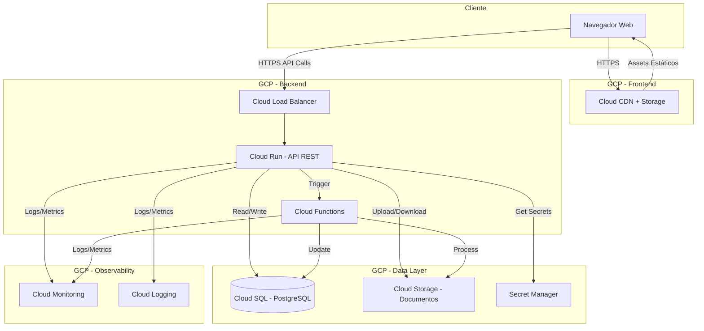

# Arquitetura do Sistema - Secretaria Online

## 1. Stack Tecnológica

### Frontend
- **Framework:** React 18+ com TypeScript
- **Justificativa:**
  - Ecossistema maduro e ampla comunidade
  - TypeScript garante type safety e melhor manutenibilidade
  - Excelente performance e componentização
  - Suporte nativo a PWA para acesso offline parcial
- **Bibliotecas principais:**
  - React Router v6 (navegação e rotas)
  - TanStack Query (gerenciamento de estado servidor)
  - Zustand (gerenciamento de estado cliente)
  - React Hook Form + Zod (formulários e validação)
  - Material-UI (MUI) ou Shadcn/UI (componentes UI)
  - Axios (requisições HTTP)
  - React PDF Viewer (visualização de contratos e documentos)

### Backend
- **Linguagem/Framework:** Node.js com Express.js + TypeScript
- **Justificativa:**
  - Mesma linguagem no frontend e backend (JavaScript/TypeScript)
  - Alta performance para I/O intensivo
  - Excelente suporte a APIs REST
  - Ampla biblioteca de pacotes no npm
  - Compatível com desenvolvimento em Windows e deploy em GCP
- **Bibliotecas principais:**
  - Express.js (framework web)
  - Prisma ORM (acesso ao banco de dados)
  - Passport.js + JWT (autenticação e autorização)
  - Joi ou Zod (validação de dados)
  - Multer (upload de arquivos)
  - Node-cron (tarefas agendadas)
  - Winston (logging)
  - @google-cloud/storage (integração com GCS)

### Banco de Dados
- **Tipo:** SQL (Relacional)
- **Tecnologia:** PostgreSQL 15+
- **Justificativa:**
  - Dados altamente estruturados e relacionados (alunos, professores, cursos, matrículas)
  - Necessidade de integridade referencial e transações ACID
  - Suporte a queries complexas para relatórios
  - Excelente suporte no GCP via Cloud SQL
  - Performance superior para operações relacionais
  - JSON/JSONB para dados semiestruturados quando necessário

### Infraestrutura
- **Cloud Provider:** Google Cloud Platform (GCP)
- **Serviços principais:**
  - **Cloud Run:** Deploy do backend (containerizado, auto-scaling)
  - **Cloud Storage:** Armazenamento de documentos e contratos
  - **Cloud SQL (PostgreSQL):** Banco de dados gerenciado
  - **Cloud Load Balancing:** Distribuição de tráfego
  - **Cloud CDN:** Distribuição de assets estáticos do frontend
  - **Cloud Build:** CI/CD pipeline
  - **Cloud Monitoring & Logging:** Observabilidade
  - **Secret Manager:** Gerenciamento de credenciais
  - **Cloud Functions:** Processamento assíncrono (notificações, geração de PDFs)

## 2. Diagrama de Arquitetura



## 3. Componentes Principais

### Frontend React Application
- **Responsabilidade:** Interface do usuário para os três perfis (Admin, Professor, Aluno)
- **Tecnologias:** React, TypeScript, React Router, TanStack Query, Material-UI
- **Integrações:** API REST do backend, Cloud CDN para assets
- **Características:**
  - SPA (Single Page Application)
  - Rotas protegidas por perfil de usuário
  - Upload de documentos via interface
  - Visualização e assinatura digital de contratos

### API Gateway / Backend REST
- **Responsabilidade:** Orquestração de lógica de negócios, autenticação, autorização e acesso a dados
- **Tecnologias:** Node.js, Express.js, TypeScript, Prisma ORM
- **Integrações:** Cloud SQL, Cloud Storage, Cloud Functions
- **Endpoints principais:**
  - `/api/auth/*` - Autenticação e gerenciamento de sessão
  - `/api/admin/*` - Operações administrativas (CRUD de entidades)
  - `/api/professor/*` - Operações de professores
  - `/api/aluno/*` - Operações de alunos
  - `/api/documents/*` - Upload e download de documentos
  - `/api/requests/*` - Sistema de solicitações

### Authentication & Authorization Service
- **Responsabilidade:** Gerenciamento de autenticação, geração de tokens JWT, controle de acesso baseado em roles
- **Tecnologias:** Passport.js, JWT, bcrypt
- **Integrações:** Cloud SQL (tabela de usuários)
- **Características:**
  - Login com email e senha
  - Tokens JWT com refresh token
  - RBAC (Role-Based Access Control): Admin, Professor, Aluno
  - Primeiro acesso obrigatório com troca de senha

### Document Management Service
- **Responsabilidade:** Upload, armazenamento, validação e download de documentos
- **Tecnologias:** Multer, @google-cloud/storage, Sharp (processamento de imagens)
- **Integrações:** Cloud Storage, Cloud SQL (metadados)
- **Características:**
  - Upload seguro com validação de tipo e tamanho
  - Organização por tipo de documento e usuário
  - URLs assinadas para download seguro
  - Versionamento de documentos

### Contract Management Service
- **Responsabilidade:** Geração, apresentação e aceite digital de contratos
- **Tecnologias:** PDFKit ou Puppeteer (geração), Cloud Functions
- **Integrações:** Cloud Storage, Cloud SQL
- **Características:**
  - Templates de contrato parametrizados
  - Assinatura digital com timestamp
  - Renovação automática conforme regras de negócio
  - Histórico de aceites

### Request Processing Service
- **Responsabilidade:** Gerenciamento de solicitações de alunos (atestados, históricos, certificados, etc.)
- **Tecnologias:** Node.js, Cloud Functions (processamento assíncrono)
- **Integrações:** Cloud SQL, Cloud Storage
- **Características:**
  - Workflow de aprovação
  - Notificações de mudança de status
  - Geração automática de documentos

### Database Layer (PostgreSQL)
- **Responsabilidade:** Persistência de dados estruturados
- **Tecnologias:** Cloud SQL PostgreSQL, Prisma ORM
- **Integrações:** Todas as APIs backend
- **Principais entidades:**
  - Usuários (Admin, Professor, Aluno)
  - Pessoas (dados pessoais compartilhados)
  - Cursos, Disciplinas, Turmas
  - Matrículas, Notas
  - Documentos (metadados)
  - Contratos, Solicitações

## 4. Estrutura de Pastas

```
secretaria_online/
├── frontend/
│   ├── public/
│   │   ├── index.html
│   │   └── assets/
│   ├── src/
│   │   ├── components/          # Componentes reutilizáveis
│   │   │   ├── common/          # Componentes genéricos
│   │   │   ├── forms/           # Formulários
│   │   │   └── layouts/         # Layouts de página
│   │   ├── pages/               # Páginas por perfil
│   │   │   ├── admin/
│   │   │   ├── professor/
│   │   │   ├── aluno/
│   │   │   └── auth/
│   │   ├── services/            # Chamadas à API
│   │   │   └── api/
│   │   ├── hooks/               # Custom hooks
│   │   ├── store/               # Estado global (Zustand)
│   │   ├── types/               # TypeScript types/interfaces
│   │   ├── utils/               # Funções utilitárias
│   │   ├── routes/              # Configuração de rotas
│   │   ├── App.tsx
│   │   └── main.tsx
│   ├── package.json
│   ├── tsconfig.json
│   ├── vite.config.ts
│   └── Dockerfile
│
├── backend/
│   ├── src/
│   │   ├── config/              # Configurações (DB, env)
│   │   ├── controllers/         # Controladores REST
│   │   │   ├── admin/
│   │   │   ├── professor/
│   │   │   ├── aluno/
│   │   │   └── auth/
│   │   ├── services/            # Lógica de negócio
│   │   │   ├── auth.service.ts
│   │   │   ├── document.service.ts
│   │   │   ├── contract.service.ts
│   │   │   └── request.service.ts
│   │   ├── repositories/        # Acesso a dados (Prisma)
│   │   ├── middlewares/         # Middlewares Express
│   │   │   ├── auth.middleware.ts
│   │   │   ├── rbac.middleware.ts
│   │   │   └── validation.middleware.ts
│   │   ├── routes/              # Definição de rotas
│   │   │   ├── admin.routes.ts
│   │   │   ├── professor.routes.ts
│   │   │   ├── aluno.routes.ts
│   │   │   └── auth.routes.ts
│   │   ├── types/               # TypeScript types
│   │   ├── utils/               # Funções utilitárias
│   │   ├── validators/          # Schemas de validação
│   │   ├── app.ts               # Configuração Express
│   │   └── server.ts            # Entry point
│   ├── prisma/
│   │   ├── schema.prisma        # Schema do banco
│   │   └── migrations/          # Migrações
│   ├── tests/                   # Testes unitários e integração
│   ├── package.json
│   ├── tsconfig.json
│   └── Dockerfile
│
├── functions/                    # Cloud Functions
│   ├── contract-generator/
│   ├── document-processor/
│   └── notification-sender/
│
├── infrastructure/               # IaC (Terraform)
│   ├── main.tf
│   ├── variables.tf
│   └── modules/
│
├── docs/                         # Documentação
│   ├── requirements.md
│   ├── architecture.md
│   ├── api-docs.md
│   └── deployment.md
│
├── .github/
│   └── workflows/                # GitHub Actions (CI/CD)
│       ├── frontend-ci.yml
│       └── backend-ci.yml
│
├── docker-compose.yml            # Desenvolvimento local
└── README.md
```

## 5. Padrões de Projeto

### Arquitetura
- **Padrão escolhido:** Layered Architecture (Arquitetura em Camadas) + Service Layer Pattern
- **Justificativa:**
  - Separação clara de responsabilidades
  - Facilita manutenção e testes
  - Escalabilidade horizontal e vertical
  - Adequado para aplicações CRUD complexas
- **Camadas:**
  1. **Presentation Layer** (Frontend React)
  2. **API Layer** (Controllers/Routes)
  3. **Business Logic Layer** (Services)
  4. **Data Access Layer** (Repositories/Prisma)
  5. **Database Layer** (PostgreSQL)

### Design Patterns

1. **Repository Pattern**
   - **Quando usar:** Acesso a dados via Prisma
   - **Objetivo:** Abstrair lógica de acesso a dados, facilitar testes e manutenção

2. **Dependency Injection**
   - **Quando usar:** Injeção de serviços e repositórios nos controllers
   - **Objetivo:** Reduzir acoplamento, facilitar testes unitários

3. **Middleware Pattern**
   - **Quando usar:** Autenticação, autorização, validação, logging
   - **Objetivo:** Interceptar requisições de forma modular e reutilizável

4. **Factory Pattern**
   - **Quando usar:** Criação de contratos, documentos, relatórios
   - **Objetivo:** Centralizar lógica de criação de objetos complexos

5. **Strategy Pattern**
   - **Quando usar:** Diferentes tipos de solicitações (atestado, histórico, certificado)
   - **Objetivo:** Permitir diferentes implementações de processamento

6. **Observer Pattern (via Events)**
   - **Quando usar:** Notificações assíncronas (mudança de status, novos documentos)
   - **Objetivo:** Desacoplar componentes que reagem a eventos

7. **DTO (Data Transfer Object)**
   - **Quando usar:** Transferência de dados entre camadas
   - **Objetivo:** Validação, transformação e encapsulamento de dados

## 6. Decisões Técnicas Importantes

### 1. Escolha de PostgreSQL sobre NoSQL
- **Decisão:** Utilizar banco relacional (PostgreSQL)
- **Justificativa:**
  - Dados altamente relacionados (alunos ↔ cursos ↔ disciplinas ↔ turmas)
  - Necessidade de integridade referencial
  - Queries complexas para relatórios
  - Transações ACID são críticas para matrículas e notas

### 2. Monolito Backend com Cloud Functions para processamento assíncrono
- **Decisão:** API monolítica no Cloud Run + Cloud Functions para tarefas assíncronas
- **Justificativa:**
  - Simplicidade inicial de desenvolvimento e deploy
  - Cloud Run oferece auto-scaling
  - Cloud Functions para processamento pesado (PDFs, notificações)
  - Caminho claro para migração futura para microserviços se necessário

### 3. TypeScript em todo o stack
- **Decisão:** TypeScript no frontend e backend
- **Justificativa:**
  - Type safety reduz bugs em produção
  - Melhor DX com autocomplete e refactoring
  - Compartilhamento de types entre frontend e backend
  - Facilita manutenção em equipe

### 4. Armazenamento de documentos no Cloud Storage
- **Decisão:** Documentos no GCS, apenas metadados no banco
- **Justificativa:**
  - Evita bloat no banco de dados
  - Escalabilidade ilimitada
  - URLs assinadas para segurança
  - CDN integrado para performance

### 5. JWT com Refresh Token
- **Decisão:** Autenticação stateless com JWT
- **Justificativa:**
  - Escalável horizontalmente
  - Sem necessidade de sessão no servidor
  - Compatível com Cloud Run (stateless)
  - Refresh token para segurança adicional

### 6. Prisma ORM
- **Decisão:** Prisma como ORM
- **Justificativa:**
  - Type-safe queries
  - Migrations automáticas
  - Excelente DX com auto-complete
  - Compatível com PostgreSQL e TypeScript

## 7. Considerações de Segurança

### Autenticação
- **Estratégia:** JWT (Access Token + Refresh Token)
- **Detalhes:**
  - Access token com expiração curta (15-30 min)
  - Refresh token com expiração longa (7-30 dias)
  - Senha hash com bcrypt (salt rounds: 12)
  - Primeiro acesso obrigatório com troca de senha
  - Logout invalida refresh token

### Autorização
- **Estratégia:** RBAC (Role-Based Access Control)
- **Detalhes:**
  - Três roles: ADMIN, PROFESSOR, ALUNO
  - Middleware de autorização valida role em cada rota
  - Alunos só acessam seus próprios dados
  - Professores só acessam suas turmas
  - Admin tem acesso total ao sistema

### Proteção de Dados
- **Estratégias:**
  - **HTTPS obrigatório** em todas as comunicações
  - **Validação de input** em todas as rotas (Joi/Zod)
  - **SQL Injection:** prevenido pelo Prisma ORM
  - **XSS:** sanitização de inputs, Content Security Policy
  - **CSRF:** tokens CSRF em operações state-changing
  - **Rate Limiting:** proteção contra brute force (express-rate-limit)
  - **Helmet.js:** headers de segurança HTTP
  - **Dados pessoais sensíveis:** criptografia em repouso (Cloud SQL encryption)
  - **Documentos:** URLs assinadas com expiração (GCS signed URLs)
  - **Secrets:** armazenados no Secret Manager, nunca em código
  - **Auditoria:** logging de todas as operações críticas

### Compliance
- **LGPD:**
  - Consentimento explícito no contrato
  - Direito de exclusão de dados
  - Minimização de dados coletados
  - Logs de acesso a dados pessoais

## 8. Escalabilidade e Performance

### Estratégias Principais

#### Backend
- **Auto-scaling:** Cloud Run escala automaticamente conforme demanda
- **Horizontal scaling:** Múltiplas instâncias do Cloud Run atrás do Load Balancer
- **Connection pooling:** Prisma com pool de conexões ao PostgreSQL
- **Caching:** Redis (Cloud Memorystore) para dados frequentemente acessados
  - Cache de notas por aluno/turma
  - Cache de estrutura de cursos/disciplinas
  - TTL configurável por tipo de dado

#### Database
- **Indexação:** Índices em campos de busca frequente (CPF, email, matrícula)
- **Read replicas:** Cloud SQL com réplicas de leitura para queries pesadas
- **Particionamento:** Tabelas grandes (notas, logs) particionadas por data
- **Query optimization:** Análise de EXPLAIN, otimização de JOINs

#### Frontend
- **Code splitting:** Lazy loading de rotas e componentes
- **CDN:** Cloud CDN para assets estáticos (JS, CSS, imagens)
- **Compression:** Gzip/Brotli para redução de tamanho
- **Image optimization:** Compressão e formatos modernos (WebP)
- **Memoization:** React.memo, useMemo, useCallback

#### Storage
- **Multi-regional bucket:** Alta disponibilidade de documentos
- **Lifecycle policies:** Mover documentos antigos para storage classes mais baratas
- **Compression:** Documentos comprimidos antes do upload

#### Monitoramento
- **Cloud Monitoring:** Métricas de CPU, memória, latência
- **Alertas:** Notificações para anomalias de performance
- **APM:** Tracing de requisições lentas
- **Log analysis:** Identificação de gargalos via logs estruturados

#### Otimizações Específicas
- **Batch operations:** Upload e processamento em lote de notas
- **Pagination:** Todas as listagens paginadas (limit/offset)
- **Lazy loading:** Carregar dados sob demanda
- **Debouncing:** Buscas e filtros com debounce
- **Background jobs:** Processamento pesado em Cloud Functions

### Estimativa de Capacidade
- **Usuários simultâneos:** 500-1000 (pico em períodos de matrícula)
- **RPS esperado:** 100-200 requests/segundo
- **Storage:** ~10GB/ano de documentos
- **Database:** ~1GB inicial, crescimento linear

---

**Observações Finais:**

Esta arquitetura foi projetada para:
- Ser desenvolvida em ambiente Windows (compatibilidade total)
- Deploy otimizado para GCP
- Escalabilidade futura sem grandes refatorações
- Foco em segurança e compliance (LGPD)
- Custo-benefício inicial com capacidade de crescimento

A escolha de tecnologias modernas e amplamente adotadas garante disponibilidade de recursos, documentação e profissionais no mercado.
